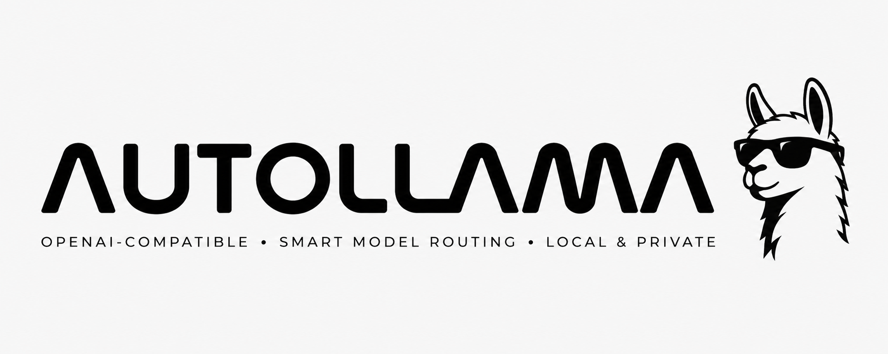

# AutoLlama



AutoLlama is a local HTTP service that exposes an OpenAI-compatible Chat
Completions API and routes each request to the best locally installed Ollama
model for the prompt.

Use it as a drop-in base URL for OpenAI-compatible clients. Send requests with
`model: "auto"` and AutoLlama classifies the latest user message, selects a
configured model bucket, and forwards the request to Ollama.

## Features

- OpenAI-compatible `POST /v1/chat/completions` endpoint
- Automatic model routing with configurable buckets
- Direct bypass by bucket name or raw Ollama model tag
- Streaming support for `stream: true`
- `x_router` metadata on non-streaming responses
- Health check and model listing endpoints
- Environment-based configuration with startup validation

## Built With

- [Python](https://www.python.org/)
- [FastAPI](https://fastapi.tiangolo.com/)
- [Uvicorn](https://www.uvicorn.org/)
- [HTTPX](https://www.python-httpx.org/)
- [Pydantic Settings](https://docs.pydantic.dev/latest/concepts/pydantic_settings/)
- [Ollama](https://ollama.com/)

## Getting Started

Follow these steps to run AutoLlama locally against an Ollama server.

### Prerequisites

- Python 3.11+
- A running [Ollama](https://ollama.com/) instance
- The Ollama models referenced by your configured buckets

The default configuration expects these models:

```sh
ollama pull qwen3:30b-a3b
ollama pull qwen2.5-coder:32b
ollama pull qwen2.5:7b
ollama pull deepseek-r1:14b
```

### Installation

1. Clone the repository and enter the project directory.

   ```sh
   git clone https://github.com/WannaCry081/AutoLlama.git
   cd AutoLlama
   ```

2. Create and activate a virtual environment.

   ```sh
   python -m venv venv
   source venv/bin/activate
   ```

3. Install Python dependencies.

   ```sh
   pip install -r requirements.txt
   ```

4. Create a local environment file.

   ```sh
   cp .env.example .env
   ```

5. Start Ollama if it is not already running.

   ```sh
   ollama serve
   ```

6. Start AutoLlama.

   ```sh
   python main.py
   ```

The server starts at `http://127.0.0.1:8000` by default. If you are using the
default settings, make sure Ollama is available at `http://localhost:11434`.

## Usage

### Let AutoLlama choose the model

```sh
curl http://127.0.0.1:8000/v1/chat/completions \
  -H "Content-Type: application/json" \
  -d '{
    "model": "auto",
    "messages": [
      {
        "role": "user",
        "content": "Write a Python function that debounces an async callable."
      }
    ]
  }'
```

Non-streaming responses are standard Chat Completions payloads with an
additional `x_router` object:

```json
{
  "choices": [
    {
      "index": 0,
      "message": {
        "role": "assistant",
        "content": "Example response text."
      },
      "finish_reason": "stop"
    }
  ],
  "x_router": {
    "bucket": "coder",
    "model": "qwen2.5-coder:32b",
    "source": "classifier"
  }
}
```

The `source` value can be:

| Source       | Meaning                                                                    |
| ------------ | -------------------------------------------------------------------------- |
| `classifier` | AutoLlama classified the prompt and selected a bucket.                     |
| `default`    | AutoLlama fell back because the prompt was empty or classification failed. |
| `explicit`   | The request named a bucket or model directly.                              |

### Bypass automatic routing

Pass a configured bucket name:

```sh
curl http://127.0.0.1:8000/v1/chat/completions \
  -H "Content-Type: application/json" \
  -d '{
    "model": "coder",
    "messages": [{"role": "user", "content": "Review this function."}]
  }'
```

Or pass a raw Ollama model tag:

```sh
curl http://127.0.0.1:8000/v1/chat/completions \
  -H "Content-Type: application/json" \
  -d '{
    "model": "qwen2.5:7b",
    "messages": [{"role": "user", "content": "Say hello."}]
  }'
```

### Use the OpenAI Python SDK

The OpenAI SDK is not required by this project, but OpenAI-compatible clients
can point at AutoLlama:

```python
from openai import OpenAI

client = OpenAI(
    base_url="http://127.0.0.1:8000/v1",
    api_key="unused",
)

response = client.chat.completions.create(
    model="auto",
    messages=[
        {"role": "user", "content": "Explain vector databases in plain English."}
    ],
)
```

### Stream responses

Set `stream` to `true` to forward Ollama's streaming response. AutoLlama
prepends one Server-Sent Events comment with the routing decision:

```text
: routed bucket=coder model=qwen2.5-coder:32b source=classifier
```

The rest of the stream is forwarded from Ollama.

## Configuration

Copy `.env.example` to `.env` and adjust the values you need. All settings are
optional; defaults are defined in `app/config.py`.

### Model buckets

`MODELS` maps bucket names to Ollama model tags. `BUCKET_DESCRIPTIONS` gives the
classifier a short description for each bucket. The keys must match.

```sh
MODELS={"general":"qwen3:30b-a3b","coder":"qwen2.5-coder:32b","fast":"qwen2.5:7b","reasoner":"deepseek-r1:14b"}
BUCKET_DESCRIPTIONS={"general":"everything else: knowledge, writing, brainstorming, summarising","coder":"programming, debugging, code review, software design, devops","fast":"short, simple, conversational, small talk","reasoner":"math, multi-step logic, formal proofs, hard puzzles"}
DEFAULT_BUCKET=general
CLASSIFIER_BUCKET=fast
```

Write bucket descriptions like concise routing instructions. They are the main
signal the classifier uses.

### Environment variables

| Variable               | Default                  | Description                                                       |
| ---------------------- | ------------------------ | ----------------------------------------------------------------- |
| `OLLAMA_URL`           | `http://localhost:11434` | Base URL for the Ollama server.                                   |
| `HOST`                 | `127.0.0.1`              | Host address for the AutoLlama server.                            |
| `PORT`                 | `8000`                   | Port for the AutoLlama server.                                    |
| `LOG_LEVEL`            | `info`                   | Uvicorn and application log level.                                |
| `MODELS`               | Built-in 4-bucket map    | JSON object mapping bucket names to Ollama model tags.            |
| `BUCKET_DESCRIPTIONS`  | Built-in 4-bucket map    | JSON object mapping bucket names to classifier descriptions.      |
| `DEFAULT_BUCKET`       | `general`                | Fallback bucket for empty prompts or failed classification.       |
| `CLASSIFIER_BUCKET`    | `fast`                   | Bucket used to classify `model: "auto"` requests.                 |
| `CLASSIFIER_TIMEOUT_S` | `30.0`                   | Timeout for the classifier call to Ollama.                        |
| `CLASSIFIER_MAX_CHARS` | `2000`                   | Maximum characters from the user prompt passed to the classifier. |

Startup validation checks that:

- `MODELS` defines at least one bucket
- every `MODELS` bucket has a matching `BUCKET_DESCRIPTIONS` entry
- `DEFAULT_BUCKET` is a key in `MODELS`
- `CLASSIFIER_BUCKET` is a key in `MODELS`

## API Reference

### `GET /healthcheck`

Returns service health and the configured Ollama URL.

```json
{
  "ok": true,
  "ollama": "http://localhost:11434"
}
```

### `GET /v1/models`

Returns `auto`, configured bucket names, and underlying Ollama model tags in an
OpenAI-style model list.

### `POST /v1/chat/completions`

Accepts an OpenAI-compatible chat completions payload.

Model selection behavior:

| Request `model`        | Behavior                                                |
| ---------------------- | ------------------------------------------------------- |
| `auto` or omitted      | Classify the latest user message and route to a bucket. |
| configured bucket name | Use that bucket's configured Ollama model.              |
| raw model tag          | Forward directly to Ollama with that model.             |

AutoLlama currently does not add authentication. Keep it on a trusted local
interface or place it behind your own auth layer before exposing it to a
network.

## How Routing Works

For `model: "auto"`, AutoLlama:

1. Extracts the latest user message from the chat payload.
2. Truncates it to `CLASSIFIER_MAX_CHARS`.
3. Asks the `CLASSIFIER_BUCKET` model to return one bucket name.
4. Routes the original request to the selected bucket's Ollama model.
5. Falls back to `DEFAULT_BUCKET` if the classifier fails or returns no match.

Automatic routing adds one extra Ollama `/api/generate` call per `auto` request.
Use a bucket name or raw model tag when you want to skip classification.

### Project Structure

```text
.
|-- app/
|   |-- api.py       # FastAPI routes
|   |-- config.py    # Environment settings and validation
|   |-- ollama.py    # Async Ollama client wrapper
|   `-- routing.py   # Classification and routing logic
|-- .env.example     # Local environment template
|-- main.py          # Application entry point
`-- requirements.txt # Python dependencies
```

## Troubleshooting

- If `/healthcheck` returns `"ok": false`, confirm Ollama is running and
  `OLLAMA_URL` points to the correct server.
- If startup fails, check that `MODELS`, `BUCKET_DESCRIPTIONS`,
  `DEFAULT_BUCKET`, and `CLASSIFIER_BUCKET` use matching bucket names.
- If routing is inaccurate, make bucket descriptions more specific or choose a
  stronger `CLASSIFIER_BUCKET` model.
- If a direct model request fails, confirm the model tag exists locally with
  `ollama list`.
